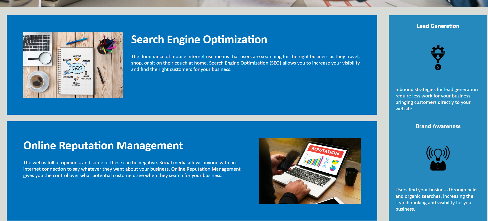
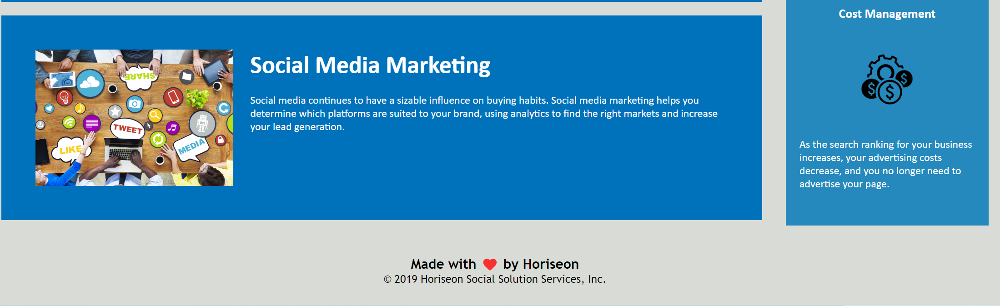

# homework1-
description
AS A marketing agency
I WANT a codebase that follows accessibility standards
SO THAT our own site is optimized for search engines

screenshot

Deployed link
https://tsedi28.github.io/homework1-/